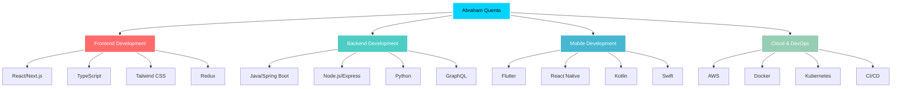

# 🌟 Lino Abraham Quenta León
### `Software Engineer | Full Stack Developer | Tech Innovator`

<div align="center">
  
[](https://git.io/typing-svg)

</div>

---

<!-- Animated header with wave effect -->


<div align="center">
  
<!-- Profile views counter with style -->

[](https://github.com/linoabraham)
[](https://github.com/linoabraham)

</div>

---

## 🎯 **About Me**

```typescript
const LinoAbraham = {
    name: "Lino Abraham Quenta León",
    role: "Software Engineer",
    location: "Lima, Peru 🇵🇪",
    education: "Computer Science Engineering",
    
    currentFocus: [
        "Full Stack Development",
        "Cloud Architecture",
        "AI Integration",
        "Mobile Applications"
    ],
    
    philosophy: "Building scalable solutions that make a difference",
    
    workingOn: {
        backend: ["Spring Boot", "Node.js", "Express", "NestJS"],
        frontend: ["React", "Next.js", "TypeScript", "Tailwind CSS"],
        mobile: ["Flutter", "React Native"],
        cloud: ["AWS", "Docker", "Kubernetes"],
        databases: ["PostgreSQL", "MongoDB", "MySQL", "Firebase"]
    },
    
    currentProjects: [
        "🌊 Sistema de Gestión de Agua",
        "🛒 E-commerce Platform",
        "🍳 Smart Cooking Assistant",
        "🏛️ Municipal Management System"
    ]
};
```

---

## 🚀 **Tech Arsenal**

<div align="center">

### **Programming Languages**
[](https://skillicons.dev)

### **Frameworks & Libraries**
[](https://skillicons.dev)

### **Backend & Cloud**
[](https://skillicons.dev)

### **Tools & DevOps**
[](https://skillicons.dev)

</div>

---

## 📊 **GitHub Analytics**

<div align="center">
  


</div>

<div align="center">
  


</div>

---

## 🏆 **Achievements & Recognition**

<div align="center">
  
[](https://github.com/ryo-ma/github-profile-trophy)

</div>

---

## 💼 **Featured Projects**

<div align="center">

| 🚀 **Project** | 🛠️ **Tech Stack** | 📝 **Description** | 🔗 **Links** |
|:---:|:---:|:---:|:---:|
| **🌊 Sistema Agua** | Java, Spring Boot | Advanced water management system | [](https://github.com/linoabraham/sistemaagua) |
| **🛒 Shop System** | Java, Spring Boot | Complete e-commerce platform | [](https://github.com/linoabraham/Shopsistem) |
| **🍳 Cook Ease** | Java, Spring Boot | Smart cooking assistant | [](https://github.com/linoabraham/cook_ease) |
| **🚚 Transport System** | Java, Spring Boot | Logistics management platform | [](https://github.com/linoabraham/transporte) |
| **⚡ Software VIP** | TypeScript, React | Premium software solution | [](https://github.com/linoabraham/SoftwareShullsVIP) |
| **🏛️ Municipal System** | TypeScript, Next.js | Government management platform | [](https://github.com/linoabraham/municipalidad-pisacoma) |

</div>

---

## 📈 **Contribution Graph**

<div align="center">
  


</div>

---

## 🎨 **Activity Graph**

<div align="center">
  
[](https://github.com/ashutosh00710/github-readme-activity-graph)

</div>

---

## 🌟 **Skills Matrix**

<div align="center">



</div>

---

## 💡 **Recent Activity**

<!--START_SECTION:activity-->
```
🔥 Pushed to linoabraham/sistemaagua
⚡ Updated linoabraham/Shopsistem
🎯 Created new repository: SoftwareShullsVIP
🌟 Starred a repository
📝 Updated README.md
```
<!--END_SECTION:activity-->

---

## 🎯 **Professional Goals 2024**

- [ ] 🚀 **Launch** 3 major open-source projects
- [ ] 📚 **Master** Kubernetes and Microservices
- [ ] 🤝 **Collaborate** with international development teams
- [ ] 🏆 **Contribute** to major open-source projects
- [ ] 📱 **Develop** cross-platform mobile applications
- [ ] ☁️ **Achieve** AWS Solutions Architect certification

---

## 🤝 **Let's Connect**

<div align="center">

[](https://www.linkedin.com/in/abraham-quenta-leon-512677188/)
[](mailto:U202022353@upc.edu.pe)
[](https://linoabraham.github.io/portfolio/)
[](https://github.com/linoabraham)

</div>

---

## 📊 **Weekly Development Breakdown**

<!--START_SECTION:waka-->
```text
Java            12 hrs 45 mins  █████████████░░░░░░░░░░░░   52.3%
TypeScript      6 hrs 32 mins   ██████████░░░░░░░░░░░░░░░   26.8%
Python          3 hrs 15 mins   ███████░░░░░░░░░░░░░░░░░░   13.4%
HTML/CSS        1 hr 45 mins    ████░░░░░░░░░░░░░░░░░░░░░    7.2%
Other           15 mins         ░░░░░░░░░░░░░░░░░░░░░░░░░    0.3%
```
<!--END_SECTION:waka-->

---

## 🎵 **Currently Listening To**

<div align="center">
  
[](https://open.spotify.com/user/31k6w3kx7d5oa4bu5x6qt7p6lqea)

</div>

---

## ⚡ **Fun Facts**

- 🌱 Currently learning **Rust** and **Go**
- 🎮 Building a **game development framework**
- 🤖 Experimenting with **AI/ML** integration
- 🏃‍♂️ Running enthusiast - **5K personal best: 22:30**
- 📚 Reading: **"Clean Architecture" by Robert C. Martin**
- ☕ **Coffee** is my programming fuel
- 🎯 **Goal**: Contribute to **Linux Kernel**

---

## 📝 **Latest Blog Posts**

<!-- BLOG-POST-LIST:START -->
- [Building Scalable Microservices with Spring Boot](https://dev.to/linoabraham/building-scalable-microservices)
- [React Performance Optimization Techniques](https://dev.to/linoabraham/react-performance-optimization)
- [Docker Best Practices for Production](https://dev.to/linoabraham/docker-best-practices)
- [TypeScript Advanced Patterns](https://dev.to/linoabraham/typescript-advanced-patterns)
<!-- BLOG-POST-LIST:END -->

---

## 🏅 **Certifications**

<div align="center">


</div>

---

<div align="center">

### 💝 **Thanks for visiting my profile!**

*"Code is like humor. When you have to explain it, it's bad."* - Cory House

**Happy Coding!** 🚀

</div>

---

<!-- Animated footer -->


---

<div align="center">
  <sub>Built with ❤️ by Abraham Quenta</sub>
</div>
